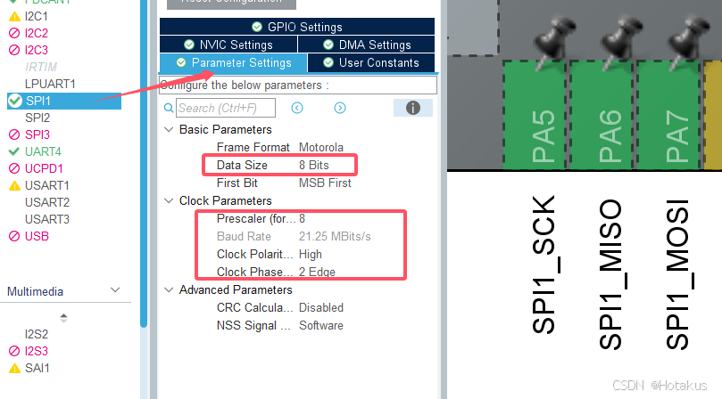

<div align="center">
<strong>
    <h1>MT6835 Framework</h1>
    首发，纯C语言实现，跨平台（stm32、ESP32），移植灵活，低耦合高内聚的 <br> MT6835（21位磁编） 驱动框架  <br>
    若您觉得不错，可以帮忙点个 Star⭐，谢谢！
</strong>

</div>

[](https://blog.csdn.net/qq_26106317/article/details/145571140?fromshare=blogdetail&sharetype=blogdetail&sharerId=145571140&sharerefer=PC&sharesource=qq_26106317&sharefrom=from_link)

---

### 1. 获取代码：

请为你的Git账户配置好SSH，然后在你喜欢的项目目录下使用以下命令

```bash
git clone git@github.com:Hotakus/mt6835.git
```

---

### 2. 加入你的项目

#### 2.1 以 STM32 为例:

该项目为标准 CMake 项目，可以很方便的加入你的项目中。  
例如，STM32CubeMX 可以自动生成 STM32 的 CMake 工程文件，请在你的根目录的`CMakeLists.txt`中(不是该项目)加入以下内容：

```cmake
add_subdirectory(mt6835) # 添加子目录，在 add_executable() 之前

# 找到这句话，在上下加入代码
add_executable(${PROJECT_NAME}.elf ${SOURCES} ${LINKER_SCRIPT})

# 假设你的项目名为 “your_project”，则添加依赖⬇
# target_link_libraries 一般放在 add_executable() 之后
target_link_libraries(your_project mt6835) 
```

#### 2.2 以 ESP-IDF 为例:

若你使用其他平台，请跳过该小节  
若你使用 ESP-IDF 框架进行 ESP32 开发，首先，你的ESP-IDF项目根目录应该会有一个`components`文件夹，
若没有，请自己创建一个，这个目录用于添加额外组件（拉取的本项目同样要放在这个目录下）。  
接下来，进入mt6835项目根目录，注意到`CMakeLists_esp_idf.txt`文件，
然后将`CMakeLists.txt`与该文件名进行交换即可。ESP-IDF 会自动检测

---

### 3. 对接 API

程序预留硬件抽象层 API 给用户对接，对于 MT6835，采用 SPI 全双工通信，可以读出21位的角度原始数据，请确保以下：

- 提前配置好 SPI 全双工通信（例如 STM32 可以使用 STM32CubeMX 配置 SPI1 ）
- SPI 时钟理论不超过 16MHz，
- CPOL(1), CPHA(1)，8bit 数据模式，
- 软 CS，提前配置好一根 CS 引脚，默认拉高

在该项目的 `example` 目录，你可以看到预先实现的对应平台的移植文件，可以直接放到你的项目中使用。若你想要自己实现，可以参考下面的示例：

#### 3.1 以 STM32 为例：

```c++
#include <math.h>
#include "mt6835.h" // MT6835 驱动头文件
#include "spi.h"    // STM32CubeMX 生成的 SPI 头文件

#define SPI_INSTANCE hspi1             // STM32CubeMX 生成的 SPI 句柄
#define SPI_CS       SPI1_CS_Pin       // STM32CubeMX 生成的 CS 引脚
#define SPI_CS_PORT  SPI1_CS_GPIO_Port // STM32CubeMX 生成的 CS 端口

// 示例 CS 操作函数，可以根据需要进行修改
static void mt6835_cs_control(mt6835_cs_state_enum_t state) {
    if (state == MT6835_CS_HIGH) {  
        // 高电平
        HAL_GPIO_WritePin(SPI_CS_PORT, SPI_CS, GPIO_PIN_SET);
    } else {
        // 低电平
        HAL_GPIO_WritePin(SPI_CS_PORT, SPI_CS, GPIO_PIN_RESET);
    }
}

// 示例收发函数，可以根据需要进行修改
static void mt6835_spi_send_recv(uint8_t *tx_buf, uint8_t *rx_buf, uint8_t len) {
    HAL_StatusTypeDef status = HAL_OK;
    status = HAL_SPI_TransmitReceive_IT(&SPI_INSTANCE, tx_buf, rx_buf, len);
    if (status != HAL_OK) {
        printf("spi send_recv failed %d\n\r", status);
        return;
    }
    // wait IT
    uint32_t tickstart = HAL_GetTick();
    while (HAL_SPI_GetState(&SPI_INSTANCE) != HAL_SPI_STATE_READY) {
        if (HAL_GetTick() - tickstart > 1) {
            printf("spi send_recv timeout\n\r");
            return;
        }
    }
}

int main(void) { 
    /* STM32CubeMX 生成的初始化 */
    HAL_Init();
    ......
    MX_SPI1_Init();
    
    /* 创建 MT6835 对象 */
    mt6835_t *mt6835 = mt6835_create();
    /* 链接 SPI 的 CS 操作函数 */
    mt6835_link_spi_cs_control(mt6835, mt6835_cs_control);
    /* 链接 SPI 收发函数 */
    mt6835_link_spi_send_recv(mt6835, mt6835_spi_send_recv);
    
    /* 可选 */
    // mt6835_link_spi_send(mt6835, mt6835_spi_send);
    // mt6835_link_spi_recv(mt6835, mt6835_spi_recv);
    
    /* 是否开启 CRC 校验，使用查表法，通常不会有性能影响
     * 若开启，则会使用 mt6835_t 结构体中的 crc_res 位存储该次角度读取正确性，
     * 用户可以根据 crc_res 的值进行判断，
    */
    mt6835_enable_crc_check(mt6835);
    // mt6835_disable_crc_check(mt6835);    // 禁用 CRC 校验
    
    /* 开始读取角度 */
    uint32_t raw_angle = 0;
    float radian_angle = 0.0f;
    while(1) {
        /* 
        * 读取原始角度数据
        * 第二个参数为读取方式, MT6835_READ_ANGLE_METHOD_NORMAL 或 MT6835_READ_ANGLE_METHOD_BURST 
        * MT6835_READ_ANGLE_METHOD_BURST 会更快
        */
        raw_angle = mt6835_get_raw_angle(mt6835, MT6835_READ_ANGLE_METHOD_BURST);
        radian_angle = raw_angle * (M_PI * 2.0f) / MT6835_ANGLE_RESOLUTION;
        // radian_angle = mt6835_get_angle(motor1_mt6835, MT6835_READ_ANGLE_METHOD_BURST);
        
        if (!mt6835->crc_res) {
            printf("crc error\n\r");
        }
        
        printf("raw_angle: %d, radian_angle: %f\n\r", raw_angle, radian_angle);
        HAL_Delay(500);
    }
}
```

若不想自己实现，则直接将`example/stm32/mt6835_stm32_spi_port.h`文件中宏定义`MT6835_STM32_SPI_PORT_ENABLE`改为`1`即可：  
然后按照如下调用：

```c++
int main() {
    uint32_t raw_angle = 0;
    float radian_angle = 0.0f;
    mt6835_t * mt6835 = mt6835_stm32_spi_port_init();
    
    while(1) {
        raw_angle = mt6835_get_raw_angle(mt6835, MT6835_READ_ANGLE_METHOD_BURST);
        radian_angle = raw_angle * (M_PI * 2.0f) / MT6835_ANGLE_RESOLUTION;
        // radian_angle = mt6835_get_angle(motor1_mt6835, MT6835_READ_ANGLE_METHOD_BURST);
        printf("raw_angle: %d, radian_angle: %f\n\r", raw_angle, radian_angle);
        HAL_Delay(500);
    }
}
```

---

### 4. 更多函数说明

- 创建销毁函数：
    - `mt6835_create()` 创建一个 mt6835 对象
    - `mt6835_destroy()` 销毁一个 mt6835 对象

- 链接函数：
    - `mt6835_link_spi_send()` 链接 SPI 发送函数
    - `mt6835_link_spi_recv()` 链接 SPI 接收函数
    - `mt6835_link_spi_send_recv()` 链接 SPI 收发函数
    - `mt6835_link_spi_cs_control()` 链接 CS 引脚操作函数
- CRC：
    - `mt6835_enable_crc_check()` 使能 CRC 校验（查表法）
    - `mt6835_disable_crc_check()` 失能 CRC 校验
- GET 和 SET 函数
    - `mt6835_get_id()` 读取 MT6835 ID 寄存器
    - `mt6835_set_id()` 暂时写入 MT6835 ID 寄存器（配合 `mt6835_write_eeprom()` 函数）
    - `mt6835_get_raw_angle()` 读取原始角度数据（21位）
    - `mt6835_get_angle()` 读取原始角度数据并换算为弧度值（0 ~ 2*PI）
    - `mt6835_get_raw_zero_angle()` 读取原始零位值（12位）（零位值在 FOC 中很重要，最好是将正确零位固化在EEPROM中）
    - `mt6835_get_zero_angle()` 读取零位值，并换算成弧度值
    - `mt6835_set_zero_angle()` 暂时写入零位值（以弧度）到寄存器，（配合 `mt6835_write_eeprom()` 函数）
- 底层函数：
    - `mt6835_read_reg()` 单字节读取寄存器
    - `mt6835_write_reg()` 单字节暂时写入寄存器（配合 `mt6835_write_eeprom()` 函数）
    - `mt6835_write_eeprom()` 将当前所有的可固化寄存器值写入（固化）到 EEPROM，所有写入操作最后都要额外调用这个函数

---

### 5. 写入 EEPROM 示例

存在寄存器的值断电消失，所以只是写入寄存器并不等于固化到 EEPROM
```c++
int main() {
    /* 写入 ID */
    mt6835_set_id(mt6835, 0xDA); // 写入 ID 0xDA 到寄存器，只在寄存器，断电消失
    HAL_Delay(1);
    uint8_t id = mt6835_get_id(mt6835); // 读取 ID
    printf("id: 0x%x\r\n", id);
    
    /* 写入特定零位值，零位值需要你自己校准并读取角度 */
    // 2.0943951024f 是 120 度，假设 120 度是零位
    mt6835_set_zero_angle(mt6835, 2.0943951024f); //写入到零位寄存器，断电消失
    HAL_Delay(1);
    float zero_angle = mt6835_get_zero_angle(mt6835); // 读取零位值
    printf("zero_angle: %f rad\r\n", zero_angle);
    
    /*下面进行统一固化，为保证断电后 MT6835 数据不丢失，需要固化到 EEPROM */
    /*
    * 直接调用 mt6835_write_eeprom 发送固化命令，
    * 命令成功发送则返回 0x55, 若正确收到 0x55，
    * 则程序 respond 为 true，错误则 false
    */
    bool respond = mt6835_write_eeprom(mt6835);
    if (!respond) {
        printf("write eeprom failed\r\n");
    } else {
        printf("write eeprom success\r\n");
    }
    HAL_Delay(6000);    // 写入后至少 6 秒钟不能断电
    
    /* 
     * 将上面的所有写入和固化操作注释掉，重新烧录程序，
     * 并重新给编码器上电，进行读取验证 
    */ 
    id = mt6835_get_id(mt6835); // 读取 ID
    printf("id: 0x%x\r\n", id);
    zero_angle = mt6835_get_zero_angle(mt6835); // 读取零位值
    printf("zero_angle: %f rad\r\n", zero_angle);
    
    // 若任何环节失败，请优先检测你的 SPI 初始化代码是否有问题，
    // 因为所有代码均经过正确验证
}
```

最后附上简单的 STM32CubeMX配置图片：  
注意另配 CS 引脚，任意引脚设置为 OUTPUT 即可


